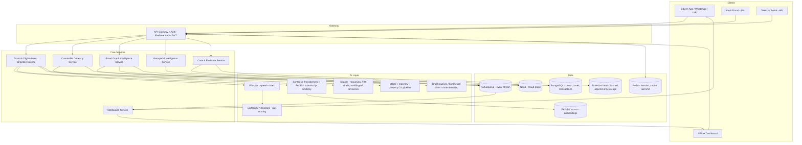

# KshemOS — AI Operating System for Digital Public Safety

**Focus Area:** AI for Digital Public Safety: Defeating Counterfeiting, Fraud & Digital Arrest Scams
---

## 1. Product Vision & Brand

**Name: KshemOS** ("Kshema" = welfare/safety/protection, Sanskrit root — dignified, government-adoptable register without colliding with the many existing "Raksha/Kavach/Suraksha"-named India safety products, sounds like an OS/platform not a single app)

**Tagline:** *"Stopping fraud before the money moves."*

**One-liner:** KshemOS is an AI operating system that sits between citizens, banks, telecom operators, and law enforcement — catching digital arrest scams, counterfeit currency, and fraud rings **in the moment they happen**, not after the FIR is filed.

**Brand identity:**
- **Logo idea:** A shield formed by two negative-space arrows converging into a checkmark (protection + verification + convergence of agencies) — navy blue (#0B2545, trust/government) + saffron accent (#FF7A00, alert/India) + white.
- **Voice:** Calm, authoritative, non-alarmist. Government-adoptable tone — think UIDAI/DigiLocker, not a startup.

---

## 2. The Core Differentiator (lead with this in any presentation)

**Live Scam Intervention Score.** While a citizen is mid-call with a "CBI officer" or mid-QR-scan, KshemOS scores the interaction in real time (voice cues + transcript + known scam-script similarity + caller metadata) and pushes a **risk overlay directly onto the citizen's phone** — before they transfer money, not after. This is technically feasible using: Whisper for live transcription → a small classifier/embedding similarity search against a labelled corpus of known scam-call transcripts → a simple risk score → a push notification / overlay UI. It's demoable in under 2 minutes and is the thing that anchors the whole pitch.

Everything else in this document supports that centerpiece: the graph engine explains *why* a number is a mule account, the counterfeit scanner extends the same "verify before you trust it" idea to physical cash, and the officer dashboard is where the intelligence lands.

---

## 3. System Architecture



**Component notes (kept to what you'd actually justify in a technical review):**
| Component | Role | Practical, buildable choice |
|---|---|---|
| API Gateway | Single entry, auth, rate limiting | FastAPI + simple JWT, or Firebase Auth if already using it |
| Scam Detection Service | Orchestrates ASR → embedding match → classifier → LLM explanation | FastAPI service, Whisper (small/base model), a LightGBM classifier trained on a small labelled/synthetic dataset |
| Counterfeit Service | Image in, forgery signal out | YOLOv8/11 fine-tuned on currency dataset (Kaggle "Indian currency" datasets exist) + OpenCV texture checks |
| Fraud Graph Service | Accounts/phones/UPI IDs/devices as nodes, shared-attribute edges | Neo4j Aura Free tier or Neo4j Desktop for a working prototype |
| Case & Evidence | Stores reports, generates FIR drafts, hashes evidence | Postgres + Claude API for drafting + SHA-256 hash log (skip real chain-of-custody crypto for now, mention it as roadmap) |
| Notification | Pushes alerts to citizen/officer | WebSocket or simple polling initially; mention Kafka as the production-scale story |

---

## 4. AI Agents (the multi-agent story)

Keep to 5 real agents you can actually wire up, not 15 that exist only in slides. Each is a distinct FastAPI microservice or a distinct LangGraph node — frame it as "agents" in the narrative regardless of implementation depth.

| Agent | Purpose | Input | Output | Model |
|---|---|---|---|---|
| **Digital Arrest Agent** | Live scam-call risk scoring | Audio/transcript, caller metadata | Risk score 0–100, flagged phrases, action recommendation | Whisper + Sentence-Transformers similarity + LightGBM |
| **Counterfeit Agent** | Currency authenticity check | Photo of note | Genuine/Suspicious + confidence + reasons | YOLO + OpenCV feature checks |
| **Fraud Graph Agent** | Link accounts/numbers/devices into rings, flag mule accounts | Transaction + entity data | Ring ID, mule probability, shared-attribute path | Neo4j graph queries (+ simple GNN if time allows, else rule-based centrality as "v1 of the GNN") |
| **Citizen Assistant** | Multilingual explainer, guided reporting, FIR drafting | Citizen text/voice query | Plain-language answer, draft FIR | Claude API |
| **Officer Copilot** | Summarizes a case, suggests next investigative step | Case + graph + call data | Case summary, prioritized leads | Claude API over structured case data |

For each, be ready to explain out loud: *input → model → output → what it hands off to the next agent.* That "handoff" story (Digital Arrest Agent flags a number → Fraud Graph Agent shows it's linked to 40 other victims → Officer Copilot drafts the case summary) is what makes it feel like an "ecosystem" rather than five components glued together.

---

## 5. Tech Stack — two versions

**A) "Vision" stack (what you present as the production architecture):**
Next.js/React/Tailwind/TypeScript, Mapbox, FastAPI, PostgreSQL, Neo4j, Kafka, Redis, Whisper, YOLOv11, Sentence-Transformers, FAISS, Claude API, Docker/Kubernetes on AWS/Azure.

**B) "Actually buildable now, free-tier" stack** (matches how you've built before — Vercel, Firebase Spark, HF Spaces, Colab):
- Frontend: Vite + React + Tailwind → **Vercel**
- Auth: **Firebase Auth** (Spark plan)
- Backend/AI inference: **FastAPI on Hugging Face Spaces** (or Colab for training/testing the CV + classifier models, exported as a small inference service)
- Graph: **Neo4j AuraDB Free** tier (has a hard node/relationship cap but plenty for a working dataset)
- Vector search: **FAISS in-process** (no hosted vector DB needed for a demo corpus)
- LLM: **Anthropic API** for multilingual advisories + FIR drafting + officer summaries
- Storage: Firebase Firestore/Storage for evidence files (mention hashing, skip building real chain-of-custody)

Say explicitly when presenting: "here's the production-grade architecture we're designing for, and here's the free-tier stack the working prototype runs on today" — this distinction reads as far more credible than pretending K8s+Kafka is running on a laptop.

---

## 6. Core Modules — implementation depth that's actually feasible

### Digital Arrest / Scam-Call Detection
- Pipeline: audio → Whisper transcript → check transcript against a small labelled corpus of known scam-call patterns (embeddings + cosine similarity) → feature vector (urgency words, threat words, mentions of "arrest"/"CBI"/"parcel"/"Aadhaar", speaking pace, silence ratio) → LightGBM risk score.
- For demonstration: pre-record 3–4 sample calls (1 genuine bank call, 2–3 scam scripts you write yourselves based on public awareness advisories — never scrape real victim data) and run them live through the pipeline.
- Be upfront in any technical discussion: real-time voice-cloning detection is a research-grade problem; show the *architecture slot* for it (a placeholder classifier) rather than claiming a solved voice-cloning detector — overclaiming here is the fastest way to lose credibility under questioning.

### Counterfeit Currency
- YOLO model fine-tuned (transfer learning, a few hours on Colab) on a small currency-image dataset for note detection + region-of-interest crops (security thread, watermark area, serial number).
- OpenCV for texture/edge consistency checks as a secondary signal, not a full UV-simulation claim.
- Output: confidence score + a short natural-language explanation ("serial number font inconsistent with reference," generated by Claude from the structured CV output — this is a nice, honest use of Claude rather than pretending the CV model itself writes prose).

### Fraud Graph Intelligence
- Nodes: Victim, Account, Phone, Device, UPI ID, Location. Edges: `SHARED_DEVICE`, `TRANSACTED_WITH`, `SAME_IP`.
- Seed with a synthetic dataset (a few hundred rows) so the graph actually shows rings and a mule account with unusually high in/out degree and shared-device edges to already-flagged accounts.
- A single well-chosen Cypher query, shown live, is more convincing than a slide claiming "Graph Neural Networks":
```cypher
MATCH (a:Account)-[:SHARED_DEVICE]-(b:Account)-[:TRANSACTED_WITH]-(v:Victim)
WHERE a.flagged = true
RETURN a, b, v
```

### Geospatial Intelligence
- A Mapbox heatmap of synthetic complaint locations, clustered by district, with a time slider. This is a good "looks impressive, cheap to build" module — don't over-invest engineering time here relative to the two flagship modules above.

### Citizen Assistant
- A Claude-powered chat widget: explains what a scam pattern is, answers "is this message a scam?", and drafts a plain-language FIR from a structured intake form. Multilingual via Claude's native language ability — you don't need 12 separate pipelines, just prompt it to respond in the citizen's chosen language.
