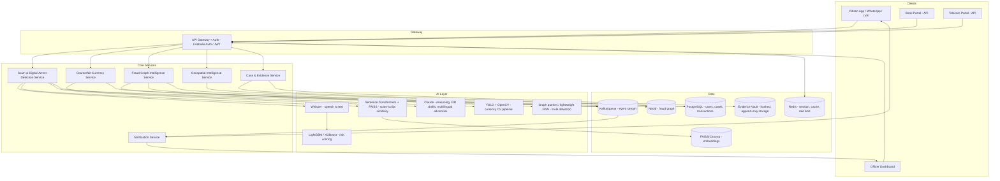

# KshemOS — AI Operating System for Digital Public Safety

**Problem Statement:** AI for Digital Public Safety: Defeating Counterfeiting, Fraud & Digital Arrest Scams

> A note before we start: the original brief asks for 20+ exhaustive sections (100M-user scaling plans, full Neo4j training pipelines, 15-day AI model evaluation reports, etc.). That's real product-company scope, not hackathon scope. What actually wins hackathons is **one sharp idea, demoed convincingly, with a coherent story around it** — judges reward depth-in-one-place over shallow breadth-in-twenty. So this blueprint keeps the ambitious vision (for the pitch and architecture slide) but is honest about what you can *actually build and demo* in a hackathon window, and flags a free-tier stack you can ship on this weekend, given you've been building on Vercel/Firebase Spark/HF Spaces/Colab before. Tell me the exact hackathon duration and team size and I'll tighten the dev plan further.

---

## 1. Product Vision & Brand

**Name: KshemOS** ("Kshema" = welfare/safety/protection, Sanskrit root — dignified, government-adoptable register without colliding with the many existing "Raksha/Kavach/Suraksha"-named India safety products, sounds like an OS/platform not a single app)

**Tagline:** *"Stopping fraud before the money moves."*

**One-liner:** KshemOS is an AI operating system that sits between citizens, banks, telecom operators, and law enforcement — catching digital arrest scams, counterfeit currency, and fraud rings **in the moment they happen**, not after the FIR is filed.

**Brand identity:**
- **Logo idea:** A shield formed by two negative-space arrows converging into a checkmark (protection + verification + convergence of agencies) — navy blue (#0B2545, trust/government) + saffron accent (#FF7A00, alert/India) + white.
- **Voice:** Calm, authoritative, non-alarmist. Government-adoptable tone — think UIDAI/DigiLocker, not a startup.

**Why this framing scores well on judging criteria:**
- *Business impact:* frames the product as infrastructure banks/telcos/police can plug into, not a standalone app — much easier "government could actually buy this" story.
- *Innovation:* the pivot from "detect after loss" to "intervene during the scam" is the single idea to hammer in every slide.

---

## 2. The One Wow Factor (lead with this in the demo)

**Live Scam Intervention Score.** While a citizen is mid-call with a "CBI officer" or mid-QR-scan, KshemOS scores the interaction in real time (voice cues + transcript + known scam-script similarity + caller metadata) and pushes a **risk overlay directly onto the citizen's phone** — before they transfer money, not after. This is technically feasible in a hackathon using: Whisper for live transcription → a small classifier/embedding similarity search against a labelled corpus of known scam-call transcripts → a simple risk score → a push notification / overlay UI. It's demoable in under 2 minutes and is the thing judges will remember.

Everything else in this document supports that centerpiece: the graph engine explains *why* a number is a mule account, the counterfeit scanner extends the same "verify before you trust it" idea to physical cash, and the officer dashboard is where the intelligence lands.

---

## 3. System Architecture



**Component notes (kept to what you'd actually justify to a judge):**
| Component | Role | Hackathon-real choice |
|---|---|---|
| API Gateway | Single entry, auth, rate limiting | FastAPI + simple JWT, or Firebase Auth if already using it |
| Scam Detection Service | Orchestrates ASR → embedding match → classifier → LLM explanation | FastAPI service, Whisper (small/base model), a LightGBM classifier trained on a small labelled/synthetic dataset |
| Counterfeit Service | Image in, forgery signal out | YOLOv8/11 fine-tuned on currency dataset (Kaggle "Indian currency" datasets exist) + OpenCV texture checks |
| Fraud Graph Service | Accounts/phones/UPI IDs/devices as nodes, shared-attribute edges | Neo4j Aura Free tier or Neo4j Desktop for demo |
| Case & Evidence | Stores reports, generates FIR drafts, hashes evidence | Postgres + Claude API for drafting + SHA-256 hash log (skip real chain-of-custody crypto for demo, mention it as roadmap) |
| Notification | Pushes alerts to citizen/officer | WebSocket or simple polling for demo; mention Kafka as the "production" story |

---

## 4. AI Agents (the multi-agent story)

Keep to 5 real agents you can actually wire up, not 15 that exist only in slides. Each is a distinct FastAPI microservice or a distinct LangGraph node — frame it as "agents" in the pitch regardless of implementation depth.

| Agent | Purpose | Input | Output | Model |
|---|---|---|---|---|
| **Digital Arrest Agent** | Live scam-call risk scoring | Audio/transcript, caller metadata | Risk score 0–100, flagged phrases, action recommendation | Whisper + Sentence-Transformers similarity + LightGBM |
| **Counterfeit Agent** | Currency authenticity check | Photo of note | Genuine/Suspicious + confidence + reasons | YOLO + OpenCV feature checks |
| **Fraud Graph Agent** | Link accounts/numbers/devices into rings, flag mule accounts | Transaction + entity data | Ring ID, mule probability, shared-attribute path | Neo4j graph queries (+ simple GNN if time allows, else rule-based centrality as "v1 of the GNN") |
| **Citizen Assistant** | Multilingual explainer, guided reporting, FIR drafting | Citizen text/voice query | Plain-language answer, draft FIR | Claude API |
| **Officer Copilot** | Summarizes a case, suggests next investigative step | Case + graph + call data | Case summary, prioritized leads | Claude API over structured case data |

For each, be ready to say out loud: *input → model → output → what it hands off to the next agent.* That "handoff" story (Digital Arrest Agent flags a number → Fraud Graph Agent shows it's linked to 40 other victims → Officer Copilot drafts the case summary) is what makes it feel like an "ecosystem" rather than five demos glued together.

---

## 5. Tech Stack — two versions

**A) "Vision" stack (what you present as the production architecture):**
Next.js/React/Tailwind/TypeScript, Mapbox, FastAPI, PostgreSQL, Neo4j, Kafka, Redis, Whisper, YOLOv11, Sentence-Transformers, FAISS, Claude API, Docker/Kubernetes on AWS/Azure.

**B) "Actually buildable this weekend, free-tier" stack** (matches how you've built before — Vercel, Firebase Spark, HF Spaces, Colab):
- Frontend: Vite + React + Tailwind → **Vercel**
- Auth: **Firebase Auth** (Spark plan)
- Backend/AI inference: **FastAPI on Hugging Face Spaces** (or Colab for training/testing the CV + classifier models, exported as a small inference service)
- Graph: **Neo4j AuraDB Free** tier (has a hard node/relationship cap but plenty for a demo dataset)
- Vector search: **FAISS in-process** (no hosted vector DB needed for a demo corpus)
- LLM: **Anthropic API** for multilingual advisories + FIR drafting + officer summaries
- Storage: Firebase Firestore/Storage for evidence files (mention hashing, skip building real chain-of-custody)

Say explicitly in the pitch: "here's the production-grade architecture we're designing for, and here's the free-tier stack the working prototype runs on today" — judges respect that distinction far more than pretending K8s+Kafka is running on a laptop.

---

## 6. Core Modules — implementation depth that's actually feasible

### Digital Arrest / Scam-Call Detection
- Pipeline: audio → Whisper transcript → check transcript against a small labelled corpus of known scam-call patterns (embeddings + cosine similarity) → feature vector (urgency words, threat words, mentions of "arrest"/"CBI"/"parcel"/"Aadhaar", speaking pace, silence ratio) → LightGBM risk score.
- For the demo: pre-record 3–4 sample calls (1 genuine bank call, 2–3 scam scripts you write yourselves based on public awareness advisories — never scrape real victim data) and run them live through the pipeline.
- Be upfront in Q&A: real-time voice-cloning detection is a research-grade problem; for the hackathon, show the *architecture slot* for it (a placeholder classifier) rather than claiming a solved voice-cloning detector — overclaiming here is the fastest way to lose technical-excellence points under questioning.

### Counterfeit Currency
- YOLO model fine-tuned (transfer learning, a few hours on Colab) on a small currency-image dataset for note detection + region-of-interest crops (security thread, watermark area, serial number).
- OpenCV for texture/edge consistency checks as a secondary signal, not a full UV-simulation claim.
- Output: confidence score + a short natural-language explanation ("serial number font inconsistent with reference," generated by Claude from the structured CV output — this is a nice, honest use of Claude rather than pretending the CV model itself writes prose).

### Fraud Graph Intelligence
- Nodes: Victim, Account, Phone, Device, UPI ID, Location. Edges: `SHARED_DEVICE`, `TRANSACTED_WITH`, `SAME_IP`.
- Seed with a synthetic dataset (a few hundred rows) so the graph actually shows rings and a mule account with unusually high in/out degree and shared-device edges to already-flagged accounts.
- A single well-chosen Cypher query, shown live, is more convincing than a slide claiming "Graph Neural Networks":
```cypher
MATCH (a:Account)-[:SHARED_DEVICE]-(b:Account)-[:TRANSACTED_WITH]-(v:Victim)
WHERE a.flagged = true
RETURN a, b, v
```

### Geospatial Intelligence
- A Mapbox heatmap of synthetic complaint locations, clustered by district, with a time slider. This is a good "looks impressive, cheap to build" module — don't over-invest engineering time here relative to the two flagship modules above.

### Citizen Assistant
- A Claude-powered chat widget: explains what a scam pattern is, answers "is this message a scam?", and drafts a plain-language FIR from a structured intake form. Multilingual via Claude's native language ability — you don't need 12 separate pipelines, just prompt it to respond in the citizen's chosen language.

---

## 7. Data Model (essentials)

**PostgreSQL (relational core):**
```sql
CREATE TABLE users (
  id UUID PRIMARY KEY, role TEXT CHECK (role IN ('citizen','officer','bank','telecom')),
  name TEXT, phone TEXT UNIQUE, language TEXT, created_at TIMESTAMPTZ DEFAULT now()
);

CREATE TABLE reports (
  id UUID PRIMARY KEY, user_id UUID REFERENCES users(id),
  type TEXT CHECK (type IN ('scam_call','counterfeit','fraud_tx')),
  risk_score NUMERIC, transcript TEXT, evidence_url TEXT,
  status TEXT DEFAULT 'open', created_at TIMESTAMPTZ DEFAULT now()
);

CREATE TABLE cases (
  id UUID PRIMARY KEY, officer_id UUID REFERENCES users(id),
  summary TEXT, priority TEXT, linked_report_ids UUID[]
);
```

**Neo4j (graph core):** `(:Account)-[:SHARED_DEVICE]-(:Account)`, `(:Account)-[:TRANSACTED_WITH]->(:Account)`, `(:Account)-[:USES]->(:UPI_ID)`.

---

## 8. Key API Endpoints (sample)

```
POST /api/scam/analyze        { audio_url | transcript }        → { risk_score, flags[], recommendation }
POST /api/currency/scan       { image_base64 }                  → { verdict, confidence, reasons[] }
GET  /api/graph/ring/{account_id}                                 → { ring_id, connected_accounts[], mule_score }
POST /api/citizen/report      { type, description, evidence }    → { report_id, draft_fir }
GET  /api/officer/case/{id}                                       → { summary, priority, linked_reports }
```

Keep auth simple for the demo: role-based JWT, Firebase Auth issuing tokens, FastAPI dependency checking role claims.

---

## 9. UI Screens (priority order — build these, skip the rest)

**Must build:** Citizen report/scan screen, live scam-call risk overlay, officer dashboard (map + graph + case list). **Nice to have if time remains:** case detail/timeline, settings, notifications. **Skip for hackathon, mention in roadmap only:** admin portal, bank/telecom portals, full dark mode, IVR.

---

## 10. Security Story (say this, don't build all of it)

RBAC (citizen/officer/bank/telecom roles), encryption in transit (HTTPS everywhere via Vercel/HF Spaces defaults), evidence hashing (SHA-256 on upload, stored alongside the file) for chain-of-custody, PII minimization (store phone numbers hashed where not needed in plaintext). Say clearly in the pitch: "for the hackathon we've implemented RBAC + basic evidence hashing; full audit logging, encryption-at-rest key management, and formal chain-of-custody tooling are the next milestone before a pilot."

---

## 11. Scalability Story (talk track, not built infra)

Explain the production path — Kafka for the call/transaction event stream, horizontal FastAPI pods behind a load balancer, Neo4j causal cluster for graph reads at scale, Redis for hot-path caching — as your **roadmap slide**, clearly separated from "what runs today." Judges scoring "scalability" want a credible plan, not a Kubernetes cluster running in the room.

---

## 12. Demo Script (under 5 minutes)

1. **(30s)** Citizen gets a call — play the pre-recorded fake-CBI scam audio through the Citizen Assistant. Live transcript appears, risk score climbs in real time, screen flags "This matches known digital-arrest scam patterns — do not transfer money."
2. **(45s)** Citizen instead scans the "bank message" asking to move funds — Citizen Assistant explains why it's a scam in their own language.
3. **(45s)** Cut to Officer Dashboard: the flagged phone number auto-populates the Fraud Graph, revealing 5 other linked accounts via shared device — one is highlighted as a likely mule account.
4. **(30s)** Officer Copilot generates a one-paragraph case summary + prioritizes it as "high" based on victim count.
5. **(30s)** Counterfeit scan demo: photograph a note, get a verdict + explanation, and show it's the *same UI pattern* as the scam-call check — "one verification mental model across fraud types."
6. **(30s)** Close on the Geo dashboard heatmap, tie back to the vision line: "before the money moves, not after the FIR."

---

## 13. Pitch Deck Outline (15 slides)

1. Title + tagline
2. The problem, in one Indian-context statistic (cite an RBI/NCRB figure you actually verify, don't invent numbers)
3. Why current systems fail (react after loss)
4. KshemOS vision — "stop it before the money moves"
5. Architecture (the Mermaid diagram, simplified)
6. The 5 AI agents and how they hand off to each other
7. Wow factor: Live Scam Intervention Score
8. Demo (live or video)
9. Counterfeit module
10. Fraud graph module
11. Business model / adoption path (state, bank, telecom partnership angle)
12. Security & compliance approach
13. Scalability roadmap
14. What's built today vs. roadmap (be explicit — this builds credibility)
15. Ask / next steps

---

## 14. Hackathon Development Plan

Tell me your actual hackathon length (24h / 36h / 48h / multi-day) and team size and I'll give you an hour-by-hour plan. Rough shape for a **4-day, 3–4 person team**:

- **Day 1:** Finalize scope, collect/synthesize datasets (scam transcripts, currency images, synthetic fraud-graph data), scaffold repos, set up Firebase/Vercel/HF Spaces.
- **Day 2:** Build Scam Detection pipeline (Whisper + classifier) and Counterfeit CV pipeline in parallel; stub APIs.
- **Day 3:** Build Fraud Graph (Neo4j + seed data + queries), Officer Dashboard, wire Citizen Assistant to Claude.
- **Day 4:** Integration, demo recording/rehearsal, deck, cut anything half-working rather than demoing something flaky.

---

## 15. Repo Structure

```
rakshakos/
  frontend/            # Vite/React/Tailwind — citizen + officer UI
  backend/
    scam_service/
    currency_service/
    graph_service/
    citizen_service/
  data/
    scam_transcripts/  # synthetic/public-advisory examples only
    currency_images/
    graph_seed/
  infra/
    docker-compose.yml
  docs/
    architecture.md
    pitch_deck/
```

---

## 16. Winning Strategy Summary

- Lead with the **Live Scam Intervention Score** — it's the single memorable idea.
- Show, don't claim: a live Cypher query beats a "GNN" slide; a real Whisper transcript beats a canned risk number.
- Be explicit about built-vs-roadmap — judges trust teams who show that boundary clearly far more than teams who claim everything is done.
- Keep the multi-agent story to 5 agents you can actually demo the handoff between, not 15 named-but-unbuilt agents.

---

**Want me to go deeper on any one piece next** — e.g. actually scaffold the FastAPI + Neo4j backend, build the React officer dashboard, fine-tune a currency-detection model in Colab, or turn the pitch outline into an actual .pptx deck?
