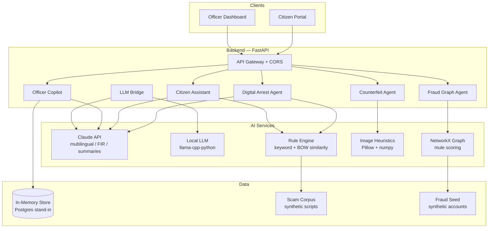

<div align="center">

# 🛡️ KshemOS — AI Operating System for Digital Public Safety

**Stopping fraud before the money moves.**

[](LICENSE)
[](https://fastapi.tiangolo.com)
[](https://react.dev)
[](https://vitejs.dev)
[](https://tailwindcss.com)
[](https://networkx.org)
[](https://anthropic.com)

**KshemOS** (Sanskrit: *kṣema* — welfare, safety, protection) is an AI operating system that sits between citizens, banks, telecom operators, and law enforcement — **catching digital arrest scams, counterfeit currency, and fraud rings in the moment they happen**, not after the FIR is filed.

> 📖 See [`KshemOS_Project_Blueprint.md`](./KshemOS_Project_Blueprint.md) for the full product vision, pitch deck outline, architecture diagrams, and hackathon development plan. This repository contains the actual buildable code.

</div>

---

## Table of Contents

- [Overview](#overview)
- [Features — The 5 AI Agents](#features--the-5-ai-agents)
- [Tech Stack](#tech-stack)
- [Repository Layout](#repository-layout)
- [Architecture](#architecture)
- [API Endpoints](#api-endpoints)
- [Frontend Pages](#frontend-pages)
- [Getting Started](#getting-started)
  - [Prerequisites](#prerequisites)
  - [Backend Setup](#backend-setup)
  - [Frontend Setup](#frontend-setup)
- [Environment Variables](#environment-variables)
- [Demo Guide](#demo-guide)
- [Running Tests](#running-tests)
- [What's Real vs. What's a Stand-In](#whats-real-vs-whats-a-stand-in)
- [Project Status: Built vs. Roadmap](#project-status-built-vs-roadmap)
- [Contributing](#contributing)
- [License](#license)

---

## Overview

Digital arrest scams, counterfeit currency, and organised fraud rings cost Indian citizens **over ₹10,000 crore annually** (NCRB/RBI reports). Current systems react *after* the money moves — after the OTP is shared, after the bank transfer is confirmed, after the FIR is filed.

**KshemOS changes this by intervening in real time.**

### The Core Idea: Live Scam Intervention Score

During a live call with a "CBI officer" or while scanning a suspicious QR code, KshemOS scores the interaction in real time using:

1. **Audio analysis** (keyword spotting + transcript similarity against known scam scripts)
2. **Image forensics** (counterfeit note detection via edge/tone/texture heuristics)
3. **Fraud graph intelligence** (network link analysis across accounts, devices, and victims)

If the risk threshold is crossed, the system pushes an intervention — **before the citizen transfers money, not after**.

---

## Features — The 5 AI Agents

| Agent | Purpose | Input | Output | Pipeline |
|---|---|---|---|---|
| **Digital Arrest Agent** | Live scam-call risk scoring | Transcript / audio text | Risk score 0–100, flagged phrases, action recommendation | Keyword + bag-of-words similarity against synthetic scam corpus |
| **Counterfeit Currency Agent** | Currency note authenticity check | Photo of note (JPEG/PNG) | Verdict (likely_genuine/suspicious/inconclusive), confidence, reasons | Pillow/numpy image heuristics (edge density, texture, sharpness, resolution) |
| **Fraud Graph Agent** | Link accounts/phones/devices into rings, flag mule accounts | Account ID | Ring ID, mule probability, connected accounts, shared signals | In-memory `networkx` graph seeded with synthetic accounts |
| **Citizen Assistant** | Multilingual explainer, guided reporting, FIR drafting | Text question + language preference | Plain-language answer or draft FIR | Claude API (falls back to rule-based placeholder if no key configured) |
| **Officer Copilot** | Case summarisation, next-step recommendation | Report ID + optional account ID | Case summary, priority, suggested next steps | Claude API over structured case + graph data |

---

## Tech Stack

### Production Vision

| Layer | Technology |
|---|---|
| **Frontend** | React 19, Vite 8, Tailwind CSS 4, Oxlint |
| **Backend** | Python 3.11+, FastAPI, Uvicorn |
| **AI / ML** | Whispr (ASR) → Sentence-Transformers + FAISS (scam-script similarity), LightGBM/XGBoost (risk scoring), YOLOv11 + OpenCV (currency CV) |
| **Graph** | Neo4j + Graph Neural Networks (production) / NetworkX (prototype) |
| **LLM** | Anthropic Claude API (Sonnet 5) |
| **Database** | PostgreSQL (relational), Neo4j (graph), FAISS/Chroma (vector) |
| **Streaming** | Apache Kafka / Redis (event stream, caching) |
| **Auth** | Firebase Auth / JWT (RBAC: citizen/officer/bank/telecom) |
| **Infra** | Docker, Kubernetes, AWS/Azure |

### What's Actually Running in This Repo

| Component | Implementation |
|---|---|
| **Frontend build** | Vite 8 + React 19 + Tailwind CSS 4 |
| **Frontend lint** | `oxlint` (oxlintrc.json) |
| **Backend server** | FastAPI 0.115 + Uvicorn 0.30 |
| **Scam detection** | Keyword scoring + bag-of-words cosine similarity (no model downloads) |
| **Currency scan** | Pillow 10.4 + numpy 1.26 image heuristics |
| **Fraud graph** | NetworkX 3.3 in-memory graph |
| **LLM integration** | Anthropic SDK 0.34 (fallback to placeholder if no key set) |
| **Data store** | In-memory Python dict (stand-in for PostgreSQL) |
| **API docs** | Auto-generated via FastAPI — `http://localhost:8000/docs` |
| **Email** | @emailjs/browser (optional, for report confirmation) |

---

## Repository Layout

```
kshemos/
├── backend/                          # FastAPI service — 5 agents, one app
│   ├── requirements.txt              # Python dependencies
│   ├── app/
│   │   ├── __init__.py
│   │   ├── main.py                   # FastAPI app factory + CORS + router includes
│   │   ├── models.py                 # Pydantic request/response models
│   │   ├── data/
│   │   │   ├── __init__.py
│   │   │   ├── scam_corpus.py        # Synthetic scam-script corpus + keyword lists
│   │   │   └── seed_graph.py         # Synthetic fraud-graph seed data
│   │   ├── routers/
│   │   │   ├── __init__.py
│   │   │   ├── scam.py               # POST /api/scam/analyze
│   │   │   ├── currency.py           # POST /api/currency/scan
│   │   │   ├── graph.py              # GET /api/graph/ring/{account_id}
│   │   │   ├── citizen.py            # POST /api/citizen/ask, /api/citizen/report
│   │   │   ├── officer.py            # GET /api/officer/case/{report_id}
│   │   │   └── llm.py                # POST /api/llm/chat
│   │   └── services/
│   │       ├── __init__.py
│   │       ├── scam_detection.py     # Keyword scoring + BOW similarity engine
│   │       ├── currency_scan.py      # Pillow/numpy image heuristic pipeline
│   │       ├── fraud_graph.py        # NetworkX graph query + mule scoring
│   │       ├── claude_client.py      # Anthropic API wrapper (with placeholder fallback)
│   │       ├── local_llm.py          # Local LLM endpoint (llama-cpp-python)
│   │       └── store.py              # In-memory report store
│
├── frontend/                         # React + Vite + Tailwind — Citizen & Officer UIs
│   ├── .env.example                  # Environment variable template
│   ├── index.html                    # SPA entry point
│   ├── package.json                  # Node dependencies & scripts
│   ├── vite.config.js                # Vite configuration (React + Tailwind plugins)
│   ├── public/
│   │   ├── favicon.svg               # Favicon
│   │   └── icons.svg                 # SVG icon sprite
│   └── src/
│       ├── main.jsx                  # React DOM root
│       ├── index.css                 # Tailwind directives + global styles
│       ├── App.jsx                   # Shell + portal routing (13+ views)
│       ├── api.js                    # API abstraction (calls local rule engine)
│       ├── ruleEngine.js             # Client-side rule engine (scam, currency, graph, report)
│       ├── scamRulePlugins.js        # Plugin architecture for scam rule extensions
│       ├── ruleEngine.test.js        # Unit tests for the rule engine
│       ├── assets/
│       │   ├── hero.png              # Home page hero image
│       │   ├── react.svg             # React logo
│       │   └── vite.svg              # Vite logo
│       └── components/
│           ├── Shell.jsx             # App shell — nav, footer, portal toggle
│           ├── HomePage.jsx          # Landing page
│           ├── CitizenPortal.jsx     # Main citizen dashboard
│           ├── OfficerCommandCenter.jsx  # Officer dashboard
│           ├── ScamIntelligencePage.jsx  # Live scam analysis (rule engine output)
│           ├── FraudGraphView.jsx        # Fraud graph visualisation
│           ├── RiskGauge.jsx             # Live risk score gauge
│           ├── AwarenessPage.jsx     # Awareness resources
│           ├── MotivationPage.jsx    # Project motivation
│           ├── AboutPage.jsx         # About KshemOS
│           ├── ContactPage.jsx       # Contact / report form
│           ├── HowItWorksPage.jsx    # How it works explainer
│           ├── ScamExamplesPage.jsx  # Real scam example library (2,200+ synthetic scenarios)
│           ├── SafetyTipsPage.jsx    # Safety best practices
│           └── ThreatLibraryPage.jsx # Threat pattern library
│
├── KshemOS_Project_Blueprint.md      # Full vision, architecture, pitch deck, dev plan
├── README.md                         # This file
├── TODO.md                           # Current task tracking
└── .gitignore                        # Git ignore rules
```

---

## Architecture



> This is the **production architecture** simplified for the hackathon prototype. Each service runs in the same FastAPI process; the module boundaries are designed so each agent can be extracted into a standalone microservice without changing its public API contract.

---

## API Endpoints

| Method | Endpoint | Agent | Description |
|---|---|---|---|
| `GET` | `/` | Health | Root health check — returns service name, status, docs URL |
| `POST` | `/api/scam/analyze` | Digital Arrest | Analyzes a transcript for scam signals. **Request:** `{ transcript, caller_claims_to_be?, caller_number? }` → **Response:** `{ risk_score, risk_band, matched_patterns, recommendation }` |
| `POST` | `/api/currency/scan` | Counterfeit | Scans a currency note image. Multipart form upload → **Response:** `{ verdict, confidence, reasons[], signals{} }` |
| `GET` | `/api/graph/ring/{account_id}` | Fraud Graph | Looks up an account in the fraud graph. → **Response:** `{ account_id, is_flagged, mule_probability, ring_id, connected_accounts[] }` |
| `POST` | `/api/citizen/ask` | Citizen Assistant | Asks a safety question. **Request:** `{ question, language }` → **Response:** `{ answer }` |
| `POST` | `/api/citizen/report` | Citizen Assistant | Submits a fraud/scam report. **Request:** `{ reporter_name, language, category, description }` → **Response:** `{ report_id, acknowledgement, draft_fir }` |
| `GET` | `/api/officer/case/{report_id}` | Officer Copilot | Generates case summary. **Query:** `?account_id=ACC-XXXX` → **Response:** `{ case_id, priority, summary, suggested_next_steps[] }` |
| `POST` | `/api/llm/chat` | LLM Bridge | Raw LLM chat endpoint. **Request:** `{ prompt, max_tokens }` → **Response:** `{ text }` |
| `GET` | `/docs` | — | Swagger UI — interactive API documentation |

All API routers are prefixed under FastAPI and auto-documented at `http://localhost:8000/docs` when the backend is running.

---

## Frontend Pages

| Route (`activeView`) | Component | Description |
|---|---|---|
| `home` | `HomePage.jsx` | Landing page with hero, call-to-action, feature highlights |
| `portal` (citizen) | `CitizenPortal.jsx` | Main citizen dashboard — scam check, currency scan, report incident |
| `portal` (officer) | `OfficerCommandCenter.jsx` | Officer command center — graph lookup, case review, copilot |
| `intelligence` | `ScamIntelligencePage.jsx` | Live scam analysis with entity extraction, evidence spans, score breakdown, timeline |
| `rule-library` | `ThreatLibraryPage.jsx` | Browse threat pattern library with categorised scam examples |
| `scam-examples` | `ScamExamplesPage.jsx` | Real-world scam scenario library (2,200+ synthetic patterns) |
| `fraud-graph` | `FraudGraphView.jsx` | Visual fraud graph explorer |
| `safety-tips` | `SafetyTipsPage.jsx` | Best practices for digital safety |
| `awareness` | `AwarenessPage.jsx` | Public awareness resources |
| `motivation` | `MotivationPage.jsx` | Why KshemOS exists — problem statement |
| `about` | `AboutPage.jsx` | Project background and team |
| `how-it-works` | `HowItWorksPage.jsx` | Technical explainer |
| `contact` | `ContactPage.jsx` | Contact form and incident reporting |

The app shell (`Shell.jsx`) provides the top-bar portal toggle (Citizen / Officer) and navigation across all views.

---

## Getting Started

### Prerequisites

- **Python** 3.11+ (3.12+ recommended)
- **Node.js** 20+ (LTS)
- **npm** 10+ (ships with Node.js)

### Backend Setup

```bash
cd backend

# Create and activate virtual environment (recommended)
python3 -m venv .venv
source .venv/bin/activate   # On Windows: .venv\Scripts\activate

# Install dependencies
pip install -r requirements.txt

# (Optional) Set your Claude API key for live AI responses
export ANTHROPIC_API_KEY=sk-ant-...

# Start the development server
uvicorn app.main:app --reload --port 8000
```

- **API docs (Swagger):** [http://localhost:8000/docs](http://localhost:8000/docs)
- **Health check:** [http://localhost:8000/](http://localhost:8000/)

### Frontend Setup

```bash
cd frontend

# Install dependencies
npm install

# Configure environment variables
cp .env.example .env
# Edit .env if your backend is not running on localhost:8000

# Start the development server
npm run dev
```

Open the URL printed in the terminal (typically `http://localhost:5173`).

> **Note:** The frontend `api.js` is wired to call a local rule engine (`ruleEngine.js`) by default, so **everything works without a running backend**. For full Claude-powered responses, start the backend and set `VITE_API_URL=http://localhost:8000` in your `.env`.

### Production Build

```bash
cd frontend
npm run build         # Outputs to frontend/dist/
npm run preview       # Preview the production build locally
```

---

## Environment Variables

### Backend (`backend/`)

| Variable | Required | Default | Description |
|---|---|---|---|
| `ANTHROPIC_API_KEY` | No | — | Claude API key. Omit to use placeholder responses for Citizen Assistant and Officer Copilot |

### Frontend (`frontend/` — set in `.env`)

| Variable | Required | Default | Description |
|---|---|---|---|
| `VITE_API_URL` | No | `''` (empty) | Backend API base URL (e.g. `http://localhost:8000`). Leave empty to use the local rule engine only |
| `VITE_EMAILJS_SERVICE_ID` | No | — | EmailJS service ID for report confirmation emails |
| `VITE_EMAILJS_TEMPLATE_ID` | No | — | EmailJS template ID |
| `VITE_EMAILJS_PUBLIC_KEY` | No | — | EmailJS public key |

---

## Demo Guide

Try these scenarios to explore all five agents. The demo runs **end-to-end with zero paid services** — no API keys required.

### 1. Digital Arrest Agent — Scam Call Analysis

1. Go to **Citizen Portal** (top-bar toggle set to "Citizen")
2. Navigate to the **Scam Intelligence** page (`intelligence` view)
3. The transcript box is pre-filled with a synthetic scam script
4. Click **"Check this call"** — the risk gauge animates to **critical (75+)**
5. Review the detailed output: entity chips (OTP, Aadhaar, amounts), evidence spans, score breakdown, tactic timeline, and scam type classification
6. Edit the text to something benign (e.g. *"calling to confirm your loan appointment at 3 PM"*) and re-run — the score drops to **low**

### 2. Counterfeit Currency Agent — Note Scanner

1. In the **Citizen Portal**, upload any photo (JPEG/PNG)
2. Results show:
   - **Verdict:** `likely_genuine` / `suspicious` / `inconclusive`
   - **Confidence score** (0–1)
   - **Signal breakdown:** edge density, texture uniformity, sharpness, resolution
   - Detailed reasons explaining each signal
3. Try sharp, well-lit, high-resolution photos → higher confidence
4. Try blurry, dark, or small images → flagged as suspicious/inconclusive

### 3. Citizen Assistant — Help & Reporting

1. Ask a question in the **Citizen Assistant** (e.g. *"I got a call from someone saying my parcel has been seized by customs"*)
2. The assistant responds in plain language with safety guidance
3. Submit a **report** using the form — note the returned `RPT-XXXX` ID
4. An email confirmation is sent if EmailJS is configured (optional)

### 4. Fraud Graph Agent — Account Ring Analysis

1. Switch to **Officer Command Center** (top-bar toggle to "Officer")
2. Go to the **Fraud Graph** view
3. Try sample account chips: **`ACC-1002`** and **`ACC-1009`** are seeded as likely mule accounts (mule probability > 0.8), linked to flagged accounts `ACC-1001` and `ACC-1008`
4. The response shows: ring ID, connected accounts, shared signals, and mule probability score

### 5. Officer Copilot — Case Intelligence

1. In the **Officer Command Center**, paste the `RPT-XXXX` ID from step 3
2. Optionally add a linked account ID (e.g. `ACC-1002`)
3. The Copilot generates:
   - **Case summary** with fraud-graph context
   - **Priority** rating (low / medium / high / critical)
   - **Suggested next steps** for investigation

---

## Running Tests

### Frontend Rule Engine Tests

```bash
cd frontend
npm test
```

This runs `ruleEngine.test.js` using Node.js native test runner (configured via `"test": "node --test"` in `package.json`).

### Backend

Tests can be run using `pytest` if configured (not yet added — see the blueprint for the intended test strategy).

### Linting

```bash
cd frontend
npm run lint          # Uses oxlint (oxlintrc.json)
```

---

## What's Real vs. What's a Stand-In

Everything runs **end-to-end with zero paid services**, so the demo works even with no API keys configured. Each stand-in is commented in the code with a `PRODUCTION UPGRADE` note pointing at what a real deployment would use instead:

| Agent | This Prototype | Production Upgrade |
|---|---|---|
| **Digital Arrest Agent** | Keyword + bag-of-words similarity scoring against a small synthetic scam-script corpus | Whisper for live audio → Sentence-Transformers + FAISS over a large, continuously-updated corpus |
| **Counterfeit Currency Agent** | Pillow/numpy image heuristics (edge density, texture, sharpness, resolution) | YOLOv11 note/region detector + OCR + reference feature-matching |
| **Fraud Graph Agent** | In-memory `networkx` graph, seeded with synthetic accounts | Neo4j + Graph Neural Network mule-probability model |
| **Citizen Assistant / Officer Copilot** | Claude API (falls back to a placeholder string if no key is set) | Same, at production scale with retrieval over full case data |
| **Data Store** | In-memory Python dict (`store.py`) | PostgreSQL with proper migrations |

---

## Project Status: Built vs. Roadmap

| Feature | Status | Notes |
|---|---|---|
| Digital Arrest Agent (transcript-based) | ✅ **Built** | Rule engine in `ruleEngine.js` + backend `scam_detection.py` |
| Digital Arrest Agent (audio / live call) | 🔜 **Roadmap** | Needs Whisper integration for ASR |
| Counterfeit Currency Agent (image heuristics) | ✅ **Built** | `currency_scan.py` + browser-side `scanCurrencyImageLocally()` |
| Counterfeit Currency Agent (YOLO / OCR) | 🔜 **Roadmap** | Needs model training + deployment pipeline |
| Fraud Graph Agent (networkx) | ✅ **Built** | `fraud_graph.py` + synthetic seed data |
| Fraud Graph Agent (Neo4j / GNN) | 🔜 **Roadmap** | Needs Neo4j Aura + GNN model |
| Citizen Assistant (rule-based fallback) | ✅ **Built** | `askCitizenAssistantLocally()` in `ruleEngine.js` |
| Citizen Assistant (Claude-powered) | ✅ **Built** | `claude_client.py` — works if `ANTHROPIC_API_KEY` is set |
| Officer Copilot | ✅ **Built** | Case summary + next steps via Claude or local fallback |
| Web UI (Citizen Portal) | ✅ **Built** | 13+ views, portal toggle, responsive layout |
| Web UI (Officer Dashboard) | ✅ **Built** | Graph lookup, case review, copilot |
| Authentication / RBAC | 🔜 **Roadmap** | See blueprint's Security section for JWT/Firebase Auth plan |
